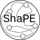

<p align="center">
    
    <br>
    
    <br>
    ShaPE, a Shape Predicate Extractor.
</p>

<p align="center">
    <a href="#summary">Summary</a>
    •
    <a href="#setup">Setup</a>
    •
    <a href="#usage">Usage</a>
    •
    <a href="#examples">Examples</a>
    •
    <a href="#benchmark">Benchmark</a>
    •
    <a href="#publications">Publications</a>
</p>

## Summary

The prototype tool ShaPE automatically learns recursive shape predicate definitions from memory graphs, so as to formally describe the pointer-based data structures contained in a program. These predicates are encoded as special Prolog predicates and can be translated to separation logic, e.g., to construct efficient secure wrappers that check if a memory graph is an instance of a learned shape predicate. ShaPE first decomposes memory graph(s) into sub-graphs, each of which exhibits a single data structure, and generates candidate shape predicates of increasing complexity, which are expressed as rule sets in Prolog. Under separation logic semantics, a meta-interpreter then performs a systematic search for a subset of rules that form a shape predicate that non-trivially and concisely captures the data structure. This repository contains an implementation of the tool in Python3 and a benchmark consisting of real-world, textbook, and synthetic examples, as well as examples taken from the research literature.

## Setup

In order to run the prototype tool on a local machine, please make sure that ...

* Python3.6 (see [https://www.python.org/](https://www.python.org/)) is linked as `python`
* the required python packages (see [`requirements.txt`](jboockmann/shape/requirements.txt)) are installed
* SWI Prolog (see [https://www.swi-prolog.org/](https://www.swi-prolog.org/)) is linked as `swipl`
* VeriFast (see [https://github.com/verifast/verifast](https://github.com/verifast/verifast)) is linked as `verifast`

Alternatively, the [`Dockerfile`](Dockerfile) can be used to build an image where dependencies are pre-installed. The [`Makefile`](Makefile) provides three convenient targets:

* `docker-build` builds the `jboockmann.shape` image
* `docker-test` spawns a new container and automatically runs all test cases
* `docker-bash` spawns a new container and provides a `bash`

## Usage

The functionality of ShaPE is accessible via an auto-generated CLI interface (see [python-fire](https://github.com/google/python-fire)). Invoking `python -m jboockmann.shape` provides an overview of all top-level commands (`learn`, `match`, etc.). Invoking `python -m jboockmann.shape COMMAND --help` provides further information on the parameters expected from the particular `COMMAND`.

The three key commands are:

* `match`: Matches the memory graph against predefined shape predicates (see [jboockmann/shape/rules-templates](jboockmann/shape/rules-templates)).
* `learn`: Learns a shape predicate for a simple, i.e., homogeneously typed, memory graph.
* `composition`: Constructs a shape predicate for a complex, i.e., non-homogeneously typed, memory graph. By default, learning a predicate is only attempted if there does not exist a predefined predicate that matches the sub-graph(s) outright.

These commands can be supplied with a single or multiple memory graphs as input. After a successful execution, the files `code.c` and `code.pl` contain the verifast proof witness and the bundled Prolog facts, respectively. The file `logfile.log` contains debug information.

## Examples

* Learn a shape predicate that characterizes the input memory graphs `bt-parent.pl`.

    ```bash
    python -m jboockmann.shape learn \
    examples-prolog/bt-parent.pl
    ```

* Learn a *single* shape predicate that characterizes the three input memory graphs `bt-null-1.pl`, `bt-null-2.pl`, and `bt-null-3.pl`.

    ```bash
    python -m jboockmann.shape learn \
    examples-prolog/series-bt/bt-null-1.pl \
    examples-prolog/series-bt/bt-null-2.pl \
    examples-prolog/series-bt/bt-null-3.pl
    ```

* Match the memory graph `cdll.pl` against all predefined shape predicates.

    ```bash
    python -m jboockmann.shape match \
    examples-prolog/cdll.pl
    ```

* Match the memory graph `cdll.pl` only against the shape predicate defined in `cdll.pl` .

    ```bash
    python -m jboockmann.shape match \
    examples-prolog/cdll.pl \
    --template_path=jboockmann/shape/rules-templates/cdll.pl
    ```

* Decompose and match (learn if no predefined shape predicate matches):

    ```bash
    python -m jboockmann.shape composition \
    examples-prolog/nesting-bt-sll.pl
    ```

## Benchmark

The memory graphs used in the benchmark are located in the folders [`examples-prolog`](examples-prolog) and [`examples-dsi`](examples-dsi). Each folder contains a README.md file that provides further information on each example. Note that while memory graphs in the former folder are stored in `.dot` format and can be viewed with a standard dot file viewer (see [`xdot`](https://github.com/jrfonseca/xdot.py)), the memory graphs in the latter folder are stored in `.pl` format, which enables a fast manual modification.

ShaPE also provides means to visualize a memory graph in `.pl` format by internally translating it to `.dot` format. The following command visualizes the example `SHN-sll-sll.pl`:

```bash
python -m jboockmann.shape visualize examples-prolog/SHN-sll-sll.pl
```

Furthermore, most benchmark examples are covered in the provided integration test suite (see [pytest](https://github.com/pytest-dev/pytest)) for which the [`Makefile`](Makefile) provides convenient targets, e.g., `integration-match`, `integration-learn`, `integration-composition`, etc.

## Publications

* [J. H. Boockmann and G. Lüttgen. Learning Data Structure Shapes from Memory Graphs. In 23rd International Conference on Logic for Programming, Artificial Intelligence and Reasoning (LPAR'23), pages 151–168. 2020.](https://easychair.org/publications/paper/mkjl)
* [J. H. Boockmann and G. Lüttgen. Shape Inference from Memory Graphs (Extended Abstract). In 20. Kolloquium Programmiersprachen und Grundlagen der Programmierung (KPS'19), pages 69–71. 2019.](https://www.hb.dhbw-stuttgart.de/kps2019/kps2019_Tagungsband.pdf#page=69)
